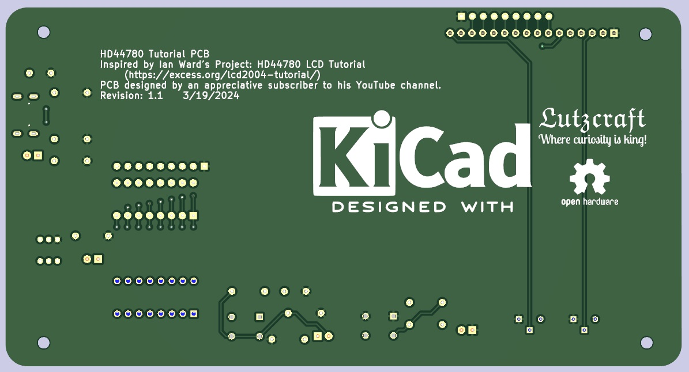

# HD44780 Tutorial PCB

My inspiration for this PCB came from following Ian Ward's project on his web site:

[LCD2004 20×4 LCD Character Display with HD44780 Tutorial](https://excess.org/lcd2004-tutorial/)

# HD44780 Tutorial PCB BOM

## Wed, Mar 20, 2024, 05:20:29

## Component Count: 18

Ref | Qty | Value | Vendor | Vendor\Part # | Description
----|-----|-------|--------|---------------|-----------
C1, C2 | 2 | .01uF | Digikey | Digikey\FG28C0G1H103JNT06 | Unpolarized capacitor 
